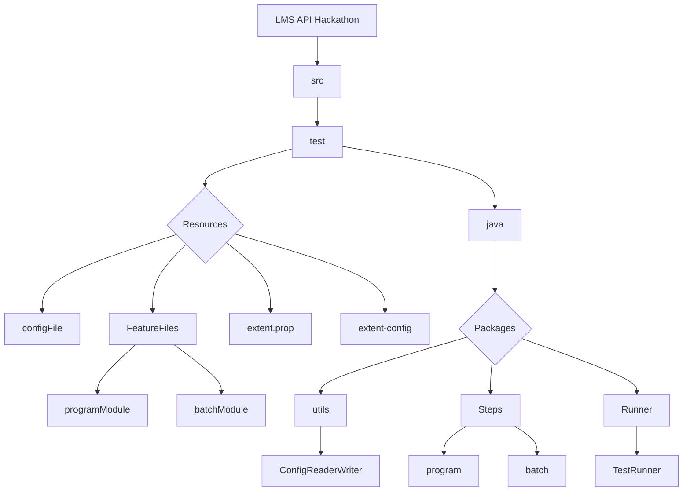
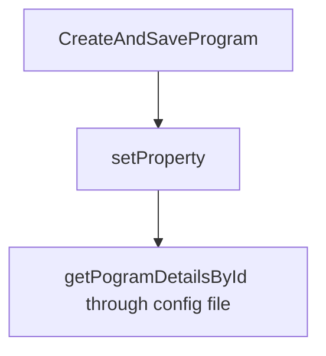

# LMS API Hackathon
## Purpose
This projects holds the scripts that can perform test automation of API using BDD Cucumber framework with generation of Extent reports.   
This document explains the project structure and how to setup /execute the testing script.

## Project Structure



## Automation of API testing can be done through RestAssured
- For implementation of restAssured the first step is to add rest-assured dependency to pom.xml

 ```xml
<dependency>
  <groupId>io.rest-assured</groupId>
  <artifactId>rest-assured</artifactId>
  <version>5.3.0</version>
  <scope>test</scope>
  </dependency>
```
## Implementation of data driven and use of dynamic data to run our scenarios
- For implementation of data driven we have use data tables as well as config file.
- following flowchart explains the implementation of dynamic data in restassured through get property and set property


- we have used date time formatter and now function to dynamically geneate currnt date of creation and modification.
```xml
 DateTimeFormatter dtf = DateTimeFormatter.ofPattern("yyyy-MM-dd'T'HH:mm:ss.SSS'Z'");
        LocalDateTime now = LocalDateTime.now(); 
```
